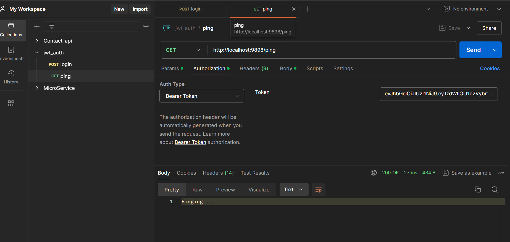

# 🍐 auth-spring-security-4-jwt

using jwt in my application

JWT TOKEN = header + payload + signature
  

    

        
    

### Instructions

- This is REST API based jwt example.
- When you run the program first time the default user is created which is 
    - username = username
    - password = 123
- you can also create users and roles using corresponding repositories 

- In the given example i send the JWT token to the user which is valid for a day. when he try to access the protected URL with token we made him authenticated through JWT token 

- In our case  we are sending the token as a body of responseEntity but you can also set this token into client's browser
- Cookie example is also present but you need to uncomment this if you want to use it

### Permitted URL'S

- localhost:8080/login = for authentication permitted to all
 
- localhost:8080/ping  = secured URL only accessible by ADMIN

### Use case

    

        
        
    

### sources

You can use this as another source : 
- [Medium.com](https://medium.com/spring-boot/spring-boot-3-spring-security-6-jwt-authentication-authorization-98702d6313a5)
 